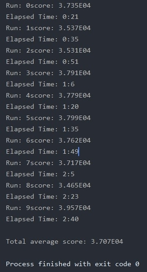
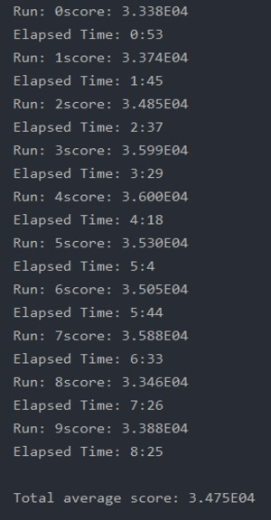

 

# Designing Intelligent Agents: Multi-Agent System

 

  

 

  <b><i>Single Agent Simulation Output.</i></b>

 

The Multi-Agent Project builds on the Single Agent Project and uses the same 2D environment and task. However, in the second project, multiple cooperating agents must collect waste and recycling from litter bins. Waste must be taken to waste stations and recycling to recycling stations. The goal of the agents is to transport as much waste and recycling as possible in a fixed period of time.

 

## Getting Started

- The java source code of the **improved agent** can be found [here](src/uk/ac/nott/cs/g53dia/multiagent/DemoLitterAgent.java).

- The **java classes** programmed for the functioning of the **fleet** can be found in the [multiagent package](src/uk/ac/nott/cs/g53dia/multiagent).

- The agent has been improved since the **first project** contained in [Designing-Intelligent-Agents_SingleAgent-System](https://github.com/EdoardoCocconi/Designing-Intelligent-Agents_SingleAgent-System).

- The source code of the given **environment** in which the agent operates can be found in the [multilibrary package](src/uk/ac/nott/cs/g53dia/multilibrary).

- To see the agent in action, run the [MultiSimulator.java](src/uk/ac/nott/cs/g53dia/multisimulator/MultiSimulator.java)

- To measure the agent performance over 10 runs, run the [MultiEvaluator.java](src/uk/ac/nott/cs/g53dia/multisimulator/MultiEvaluator.java)

 

## Environment

- the environment is an infinite 2D grid that contains randomly distributed recycling and waste bins, waste and recycling stations, and recharging points
- bins periodically generate tasks to transport a specified amount of recycling or waste (max 100 litres)
- tasks persist until they are achieved (a bin has at most one task at any time)
- recycling and waste stations can accept an infinite amount of recycling and waste respectively
- the agent can recharge at a recharging point
- the agent's battery capacity is 500
- the agent can carry 200 litres of recycling or waste at a time
- recycling and waste must not be mixed – if the agent has loaded waste it must be taken to a waste station before it collects recycling, and if it has loaded
recycling it must be taken to a recycling station before waste is loaded
- the agent can see any bins, stations and recharging points within 30 cells of its current position
- if a bin is visible, the agent can see if it has a task, and if so, how much recycling or waste is to be disposed of
- move actions take one timestep and consume 1 unit of battery
- collecting recycling and waste from a bin and unloading recycling and waste at a station takes one timestep (and consumes no battery)
- the agent starts out at a recharging point with 500 units of battery and no recycling or waste
- a run lasts 10,000 timesteps unless the agent runs out of battery, in which case the run is terminated
- the success (score) of the agent is determined by the total amount of recycling and waste collected

The multi-agent system must contain at least two agents.

 

## Individual Agent Architecture

The agent has a reactive architecture with hierarchical control. The hierarchy is implemented in the Sense method of DemoLitterAgent as a series of if-conditions. The higher the priority the earlier the condition is checked. If a condition is met, the corresponding behavior is triggered. The behaviors are listed here from highest priority to lowest priority:

-	**RechargeBehaviour:** if the agent is on the target RechargeStation perform a RechargeAction, otherwise MoveTowards RechargeStation.
-	**CollectBehaviour:** if the agent is on the target LitterBin perform a LoadAction, otherwise MoveTowards LitterBin.
-	**DisposeBehaviour:** if the agent is on the target Station perform a DisposeAction, otherwise MoveTowards Station.
-	**ExploreBehaviour:** If the agent is at distance <= 30 from the origin get away from the origin, else MoveTowards origin.

The Sense method receives percepts from 3 Sensors:

-	**RechargeDetector:** detects recharge stations inside a radius that is related to how much battery the agent has already lost. If there are recharge stations in this radius, RechargeBehaviour is triggered.
-	**LitterDetector:** detects the bin with the highest litter over distance ratio within the specified field of view.
-	**StationDetector:** detects the closest station.

The sense method runs at every timestep inside senseAndAct and selects a Behaviour. If nothing is detected, the ExploreBehaviour is selected. The selected behaviors is carried out by the Act method inside senseAndAct.

To learn more about the individual agent click [here](https://github.com/Edococco97/Designing-Intelligent-Agents_SingleAgent-System/blob/master/README.md).

 

## How has the individual agent been improved since the first project?

The project 1 agent needed to be optimized to succeed in project 2 because run times were largely exceeding 10 minutes with multiple agents. To increase efficiency, the map has been modified from a single HashMap including all the explored cells to HashMaps and ArrayLists including only non-empty cells of a specific kind. This decreases the number of both read and write operations. During construction, the agents are assigned an “agentID” that distinctively identifies them and a unique exploration direction under the name of “errorDestination”.

 

## Are the agents specialised?

The agents are all of the same kind. In real world applications, different robots usually leverage their unique hardware capabilities to perform the task they excel at. However, in a simulation every agent can be “general purpose” and just read the situation at every instant to determine the best course of action. Therefore, limiting each agent to specific tasks decreases their effectiveness and the overall performance of the fleet.

 

## How many agents are there in the Multi-Agent System (MAS)?

The MAS is composed by 2 agents in total. The agents compete for the same tasks and an increase in the number of agents results in a decrease in the points scored per agent. Therefore, since the agents are not specialized, there is no reason to increase their number above 2. Having only 2 agents also allows for a quick run time, which should be below 10 minutes on most computers.

 

## Organizational & Control Structure

The MAS is a redundant generalist organization. The control structure of the agent is distributed as none of the agents have control over the others and there is no hierarchy.

 

## Agent Communication

Each agent shares with the other agents its current destination and the content of all the non-empty cells it has already encountered. This information is updated every time the “senseAndAct” function is run. This information is updated by calling the respective functions “updateDestinationList” and updateMap, both defined in the “fleetControlCentre” class.

 

## Agent Task Allocation

The agent finds the task with the highest litter over distance ratio in the specified field of view. The field of view is inversely proportional to the current litter capacity of the agent. If the agent is 90% full, the field of view is reduced by 90%. Therefore, the agent won’t look for high value tasks that are far away because the agent could not complete them anyways. Instead, the agent prefers to go to the tasks close to it that can be completed before going to the station. 

The bin with the highest litter over distance ratio is found by the readSensor method of the LitterDetector class. The readSensor method is called in the sense method in DemoLitterAgent. When the field of view is so small that the agent does not see any task, or when the agent is full, the CollectBehaviour does not run anymore.

 

## Why the fleet architecture is appropriate for the project

As explained above, the current design of the “fleetControlCentre” allows to coordinate the agents in such a way that they never target the same task and they never fall victim of changes of plans. Further experiments included preventing an agent to claim a task that close to a task that has already been claimed by another agent. This was done to prevent competition between agents, however no matter the distancing radius, this approach always yielded inferior results. Throughout the project, giving the individual agents the freedom to take decisions based on the current situation has been rewarded with higher scores most of the times.

The performance of the MAS would be greatly decreased if the environment only contains one main task and a number of secondary low value tasks. Only one agent can claim one task and the agents are currently not able to cooperate on a single high value task.

The performance would be increased if the agents could spawn at different points of the environment so they don’t have to compete with each other.

 

## Performance

 

 

Agent's average score with 1 agent: 3.707E04

 

 

Agent's average score with 2 agents: 3.475E04

 
 

> *©  2019  Edoardo  M.  Cocconi  All  Rights  Reserved*
